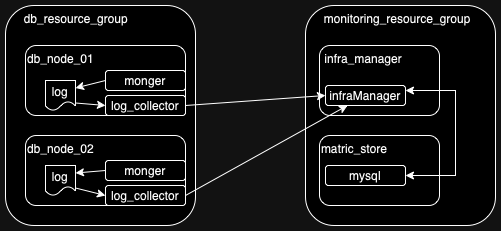

# PrometheusCollector

## System 구성도
<table style="display: flex;flex-direction: column;align-items: center;border: white">
<caption style="align-content: center;alignment: center">metric_collector</caption>
<tr><td>

</td></tr>
</table>
<br>
<table style="display: flex;flex-direction: column;align-items: center;border: white">
<caption>log_collector</caption>
<tr><td></td></tr>
</table>

## How to download sources and make default running environment
```shell
aimmodev:~/$ sudo su -
root:~/$ cd /opt
root:~/opt$ git clone https://github.com/bluewhalekr/PrometheusCollector.git collector
root:~/opt$ cd collector
root:~/opt/collector$ python -m venv venv
root:~/opt/collector$ source venv/bin/activate
root:~/opt/collector$ pip install -r requirements.txt
```

## How to install metric-collector
```shell
root:~/opt/collector$ vi config.py # edit config in your system
root:~/opt/collector$ cp collector.service /etc/systemd/system
root:~/opt/collector$ systemctl enable collector
root:~/opt/collector$ systemctl start collector
```

## How to install log_collector
```shell
root:~/opt/collector$ vi log_collector.service # edit service with your system
root:~/opt/collector$ cp log_collector.service /etc/systemd/system
root:~/opt/collector$ systemctl enable log_collector
root:~/opt/collector$ systemctl start log_collector
```
** 먼저 mongodb의 로그 레벨을 아래와 같은 방법을 이용하여 4이상으로 설정하여야 합니다.
```shell
> use admin
switched to db admin
> db.runCommand ({setParameter : 1, logLevel : 4})
```

## How to run Cron Daemon
```shell
SLACK_API_TOKEN=abcdefghijklmn python collector_cron.py
```

** Slask/ElasticSearch가 운영되고 있는 시스템은 common-bastion의 "04-database-common-els-01"입니다.